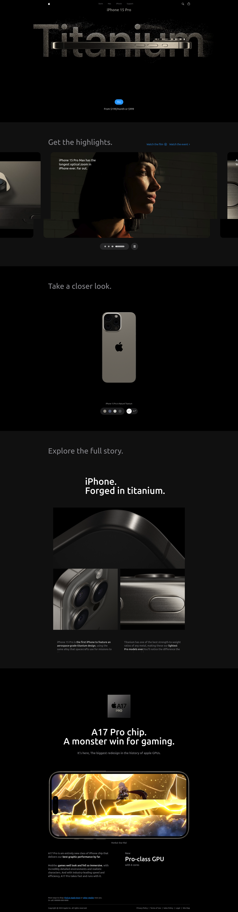

# iPhone 15 Pro Website Clone

This project is a clone of the iPhone 15 Pro website, built using modern web technologies to replicate the design and interactivity of the original site. The clone is developed with **React.js** for the frontend structure, **Three.js** for 3D animations and models, **Tailwind CSS** for styling, and **GSAP** for smooth animations and transitions.

## Key Features

- **React.js**: The project leverages React's component-based architecture to create a modular and reusable codebase, making it easy to maintain and scale.
  
- **Three.js**: Used to render 3D models of the iPhone 15 Pro, providing an immersive experience similar to the original website. The 3D models can be rotated, and interacted with.

- **Tailwind CSS**: Tailwind's utility-first approach is used to style the website, ensuring a responsive and visually appealing design that matches the original iPhone 15 Pro website.

- **GSAP**: GSAP is employed to create smooth animations, such as scroll-triggered animations, transitions, and interactive elements that enhance the user experience.

## Technologies Used

- **React.js v19**: Frontend library for building user interfaces.
- **Three.js**: 3D graphics library for rendering models and animations.
- **Tailwind CSS v4.0**: Utility-first CSS framework for styling.
- **GSAP**: Animation library for creating smooth and complex animations.
- **Vite**: Fast build tool for modern web development.

